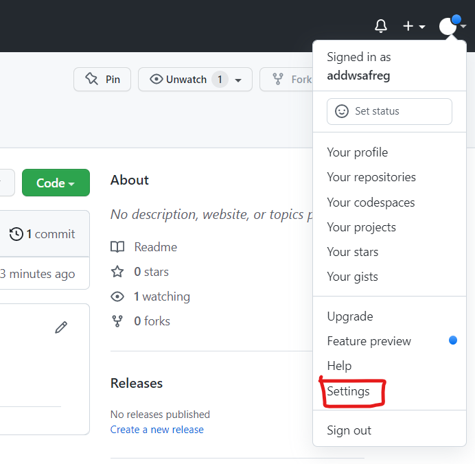
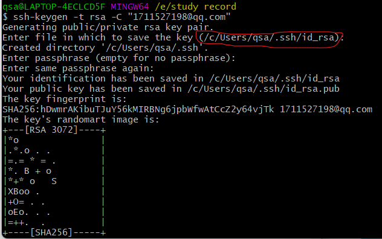
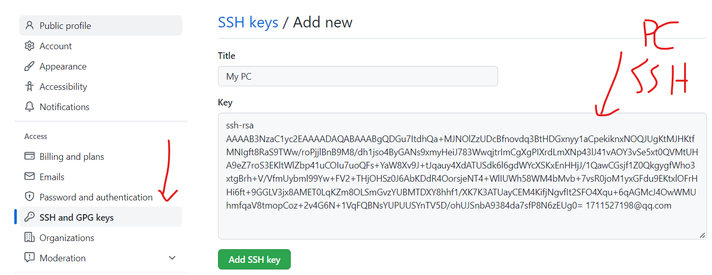

<!--
 * @Author: qsa 1711527198@qq.com
 * @Date: 2022-06-09 17:06:03
 * @LastEditors: qsa 1711527198@qq.com
 * @LastEditTime: 2022-06-09 22:46:29
 * @FilePath: \undefinede:\study record\工具使用记录\github操作记录.md
 * @Description: 这是默认设置,请设置`customMade`, 打开koroFileHeader查看配置 进行设置: https://github.com/OBKoro1/koro1FileHeader/wiki/%E9%85%8D%E7%BD%AE
-->
<!-- TOC -->

- [1. 添加仓库和上传代码](#1-添加仓库和上传代码)
  - [1.1. 连接pc端和github](#11-连接pc端和github)
  - [1.2. 上传文件](#12-上传文件)

<!-- /TOC -->
# 1. 添加仓库和上传代码
教程地址： https://www.bilibili.com/video/BV1za411j79T?spm_id_from=333.880.my_history.page.click
## 1.1. 连接pc端和github
1. 点击设置

2. 配置 SSH 密钥
    1. 生成 PC 端 SSH 密钥
     输入 ssh-keygen -t rsa -C "1711527198@qq.com"
     进入下方地址复制 .pub 文件里的密钥
     
    2. github 连接 PC的 SSH
        把复制的 SSH 密钥粘贴到下面，然后使用ssh -T git@github.com来测试和GitHub的网络通信是否正常。
        （如果提示`Hi xxxxx! You've successfully authenticated, but GitHub does not
        provide shell access.` 就表示一切正常了。）
        我的提示（ssh: connect to host github.com port 22: Connection refused），原因未知。解决办法参考：https://segmentfault.com/a/1190000041909858
        这个解决方案的思路是：给~/.ssh/config文件里添加如下内容，这样ssh连接GitHub的时候就会使用443端口。
        如果~/.ssh目录下没有config文件，新建一个即可。
        $ vim ~/.ssh/config
        ```
        # Add section below to it
        Host github.com
        Hostname ssh.github.com
        Port 443
        ```
        修改完~/.ssh/config文件后，使用 ssh -T git@github.com 来测试和GitHub的网络通信是否正常，如果提示`Hi xxxxx! You've successfully authenticated, but GitHub does not
        provide shell access.` 就表示一切正常了。
        
## 1.2. 上传文件
1. 把这个目录变成git可以管理的仓库：
    ``git init``
2. 关联到远程库：
    ``git remote add (地址的名字) (上传的github仓库地址)``
3. 获取远程库与本地同步合并:
   ``git pull --rebase (地址的名字) master``
4. 添加到暂存区里面去，如果后面接小数点“.”，意为添加文件夹下的所有文件：
    ``git add .``
5. 把文件提交到仓库。引号内为提交说明：
    ``git commit -m  "相关说明"``
6. 将最新的修改推送到远程仓库：
    ``git push -u (地址的名字) master``
    
  


